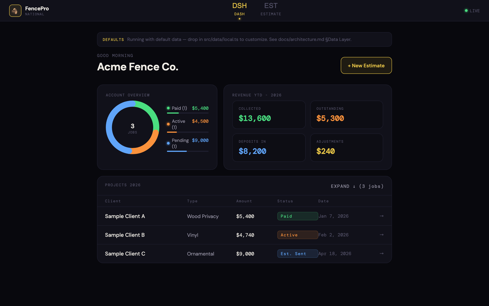
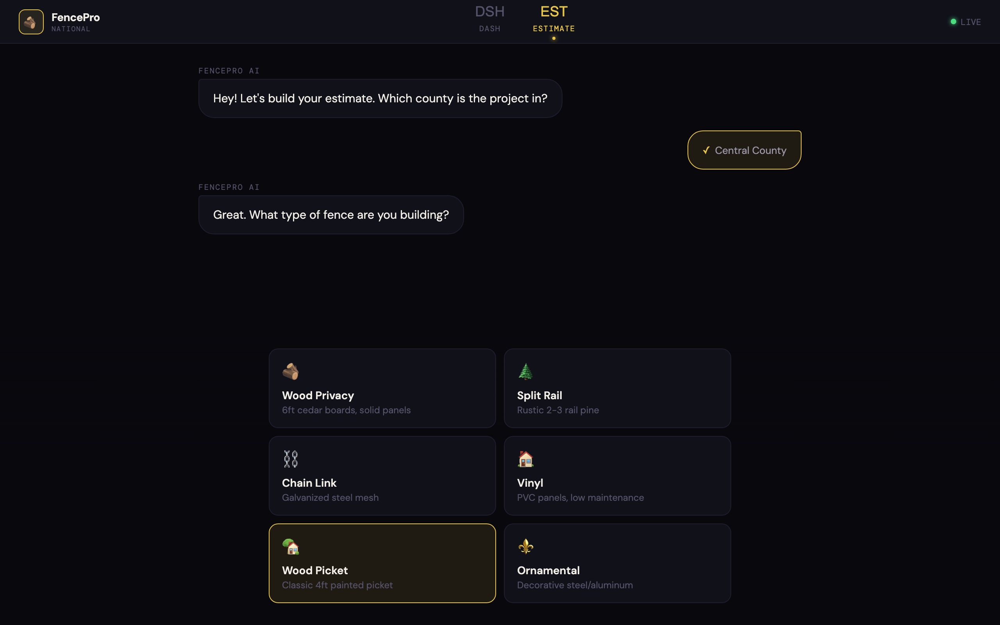
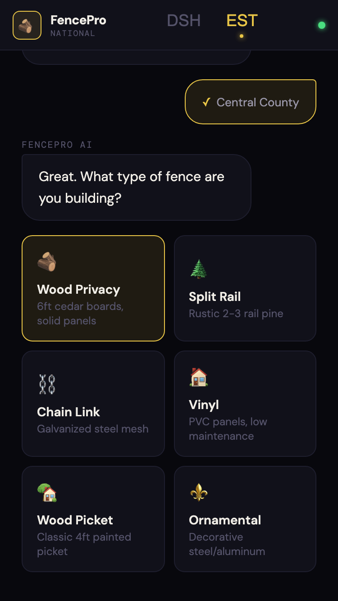
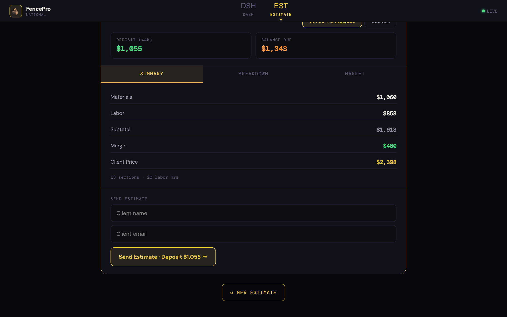
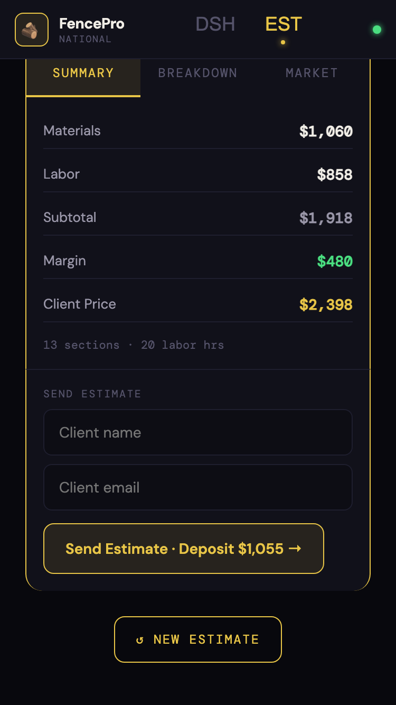
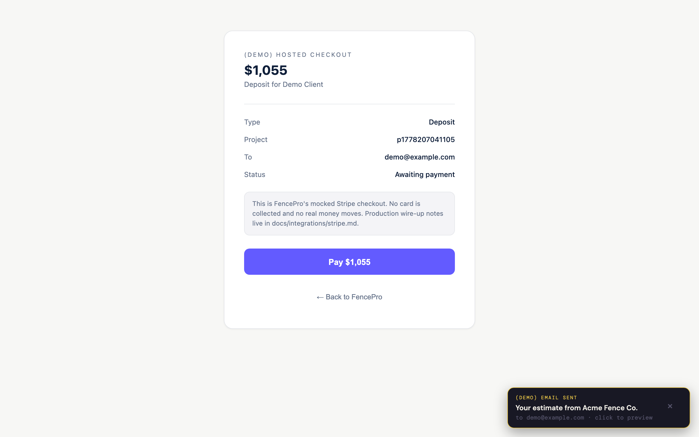
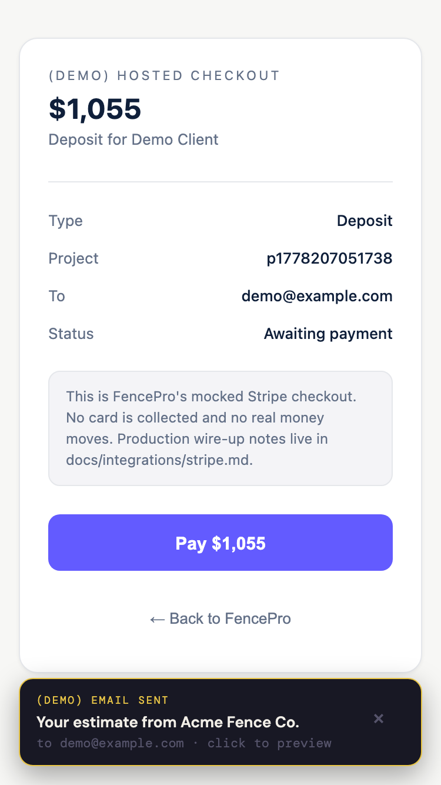
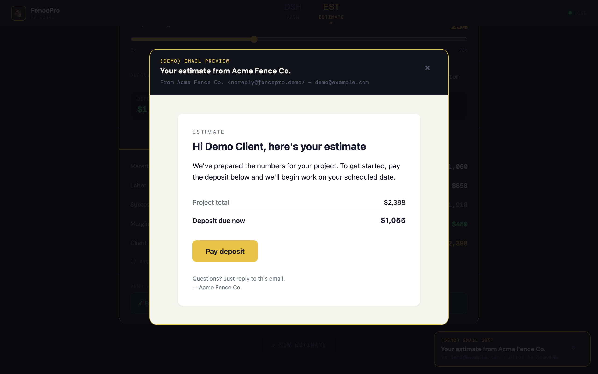
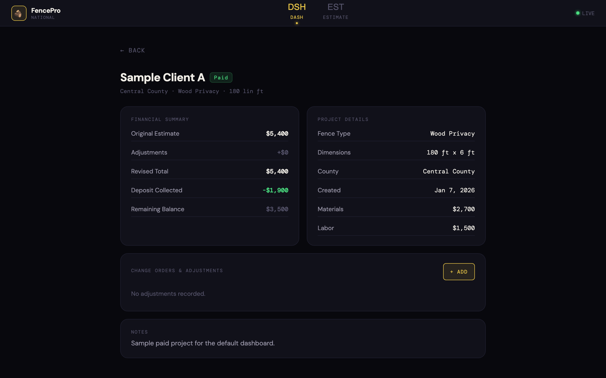
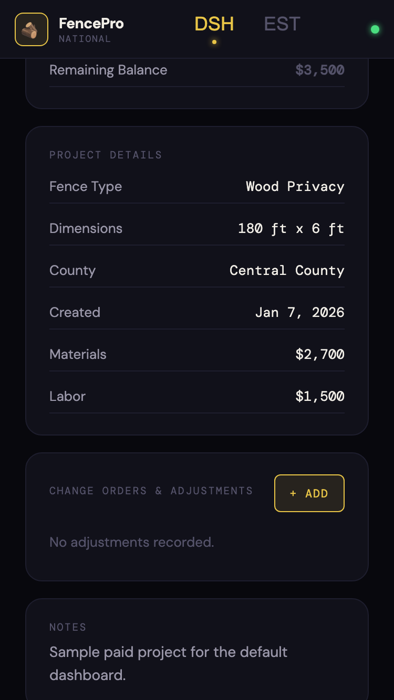

# FencePro

[](https://github.com/Rsan0948/fencepro/actions/workflows/ci.yml)
[](https://opensource.org/licenses/Apache-2.0)
[](https://github.com/Rsan0948/fencepro/releases)
[](https://nodejs.org/)

Lightweight vertical-SaaS template for fence contractors. Dashboard,
chat-driven estimate builder, project lifecycle, and a fully-typed mock
of Stripe checkout + transactional email. Frontend-only — no backend to
deploy. Mobile-responsive down to iPhone SE.



<details>
<summary>More screenshots (desktop + mobile)</summary>

### New Estimate (chat-driven)

| Desktop                                                    | Mobile                                                           |
| ---------------------------------------------------------- | ---------------------------------------------------------------- |
|  |  |

### Estimate review

| Desktop                                                      | Mobile                                                             |
| ------------------------------------------------------------ | ------------------------------------------------------------------ |
|  |  |

### Mock Stripe checkout

| Desktop                                                      | Mobile                                                             |
| ------------------------------------------------------------ | ------------------------------------------------------------------ |
|  |  |

### Email preview



### Project detail

| Desktop                                                        | Mobile                                                               |
| -------------------------------------------------------------- | -------------------------------------------------------------------- |
|  |  |

</details>

## Highlights

- **Mock-but-typed payments + email.** `PaymentProvider` and `EmailProvider`
  TypeScript interfaces with mock implementations that drive the full
  estimate → deposit → adjustments → final-invoice → paid lifecycle without
  a backend. Synthetic webhook surface (`registerPaymentWebhook`,
  `markSessionPaid`) mirrors the real Stripe shape; clicking "Pay" on the
  mock checkout flips the project status and fires a receipt email.
  Production wire-up notes in [`docs/integrations/stripe.md`](docs/integrations/stripe.md)
  and [`docs/integrations/email.md`](docs/integrations/email.md).
- **Regional data overrides without secrets in source.** Hardcoded national
  defaults work out of the box — Acme Fence Co., generic counties, neutral
  prices, three sample projects. Drop in an optional `src/data/local.ts`
  to layer real county pricing, market rates, demo project list, and
  branding. The file is gitignored. Loader is a Vite `import.meta.glob`
  that resolves to the empty case when `local.ts` is absent — no
  TypeScript module-augmentation gymnastics. See
  [`docs/architecture.md`](docs/architecture.md) §Data Layer.
- **Frontend-only by design.** React 19 + Vite + TypeScript (strict),
  persists to `localStorage` with a versioned envelope, deploys as a
  static bundle. 56 tests covering lib + services + components +
  end-to-end integration. Mobile-responsive at one breakpoint (768px)
  via a 31-line `useIsMobile()` hook. Apache 2.0.

## What works vs. what's mocked

| Surface                          | Status                                                                                         |
| -------------------------------- | ---------------------------------------------------------------------------------------------- |
| Dashboard + project lifecycle    | ✅ Live, persisted to localStorage                                                             |
| Chat-driven estimate flow        | ✅ Live                                                                                        |
| Quote calculation (county-aware) | ✅ Live                                                                                        |
| Adjustments + change orders      | ✅ Live, persisted                                                                             |
| Stripe checkout                  | 🎭 Mocked — `MockStripeProvider` clones the hosted-checkout UX                                 |
| Transactional email              | 🎭 Mocked — `MockEmailProvider` renders email HTML in a preview modal                          |
| Webhook handling                 | 🎭 Synthetic — fires in-process; real webhooks require a backend                               |
| Real payment processing          | ❌ Out of scope — see [`docs/integrations/stripe.md`](docs/integrations/stripe.md) for wire-up |

## Architecture

```
┌──────────────────────────────────────────────────────────────┐
│  Browser SPA (React 19 + Vite + React Router 7)              │
│  ├── Routes: /checkout/:sessionId + /* (App shell)           │
│  ├── Screens: Dashboard, NewEstimate, ProjectDetail,         │
│  │            FinalInvoice, MockCheckout                     │
│  ├── Adapter layer: PaymentProvider, EmailProvider           │
│  │   └── Mock implementations (production wire-up = swap     │
│  │       the implementation behind the same interface)       │
│  ├── Data layer: hardcoded defaults + optional local.ts      │
│  ├── Persistence: localStorage (versioned envelope)          │
│  └── Responsive: useIsMobile() hook, 768px breakpoint        │
└──────────────────────────────────────────────────────────────┘
```

Full design + decisions: [`docs/architecture.md`](docs/architecture.md).

## Quick Start

```bash
git clone https://github.com/Rsan0948/fencepro.git
cd fencepro
npm install
npm run dev
```

Dev server runs on http://localhost:3001.

## Customizing data

FencePro ships with system defaults that work without setup. To layer your
own regional pricing, county list, branding, or demo project data, create
`src/data/local.ts` — it's gitignored and takes precedence over the
defaults. The data contract lives at `src/data/types.ts`.

## Scripts

| Command                 | What it does                                                        |
| ----------------------- | ------------------------------------------------------------------- |
| `npm run dev`           | Start the Vite dev server on :3001                                  |
| `npm run build`         | Type-check then produce a production bundle in `dist/`              |
| `npm run preview`       | Preview the production build locally                                |
| `npm run lint`          | ESLint on the project                                               |
| `npm run format`        | Prettier write across all files                                     |
| `npm run format:check`  | Prettier check (no write)                                           |
| `npm run typecheck`     | `tsc -b --noEmit` on all TypeScript                                 |
| `npm test`              | Vitest, single run                                                  |
| `npm run test:watch`    | Vitest in watch mode                                                |
| `npm run test:coverage` | Vitest with v8 coverage                                             |
| `npm run screenshots`   | Regenerate the README screenshot set (requires Playwright Chromium) |

## Tech stack

React 19, Vite 7, TypeScript 5.9 (strict), React Router 7, Vitest 2,
React Testing Library 16, ESLint 9 (flat config), Prettier 3.

## Contributing

See [`CONTRIBUTING.md`](CONTRIBUTING.md). Bugs and security issues:
[`SECURITY.md`](SECURITY.md).

## License

Apache 2.0 — see [`LICENSE`](LICENSE) and [`NOTICE`](NOTICE).
